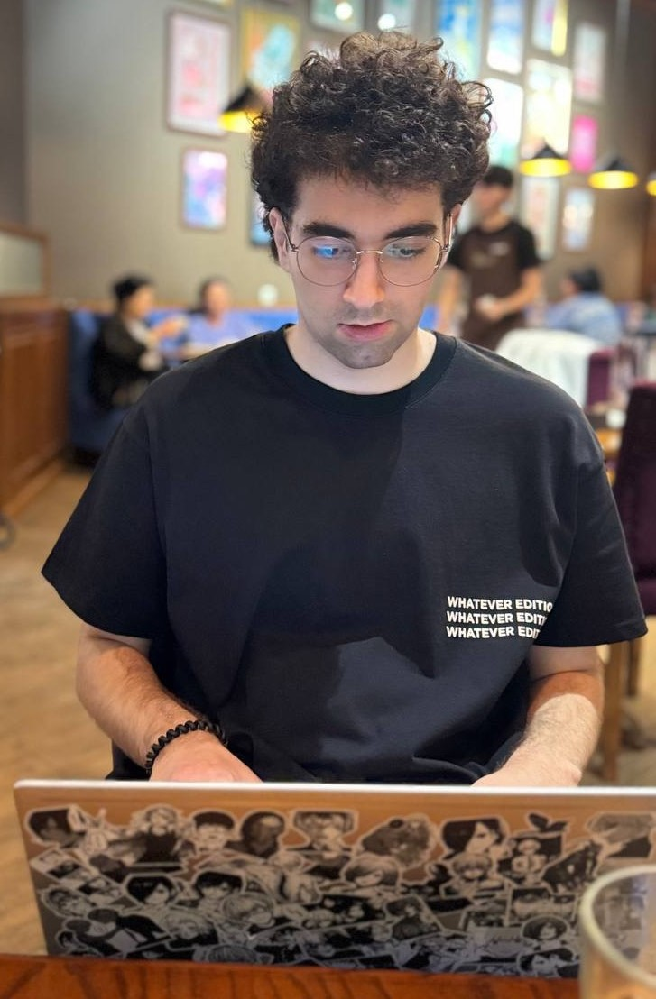

<h1>Bob's ML Engineering Journey 🚀</h1>

<table>
  <tr>
    <td></td>
    <td>

<strong>Data Scientist | Machine Learning Engineer</strong>  
I don’t just build models — I work to understand the data, the context, and the problem.  
For me, good machine learning starts with knowing what the data represents and why it matters. That’s what makes solutions useful.

 

**What I do:**  
Some days I’m tuning models. Other days I’m digging into a new domain to understand its data.  
I’ve also mentored interns, run interviews, and helped build teams.

 

**What I’m focusing on:**  
I’m getting deeper into ML research to sharpen my skills and stay current.  
Also looking to take on more leadership — guiding teams and helping others grow.

 

**Let's connect on [LinkedIn](https://www.linkedin.com/in/bobokhon-abdurakhmanov/)** 

**Let’s talk:** abdurakhmanovbobokhon@gmail.com

  </tr>
</table>
